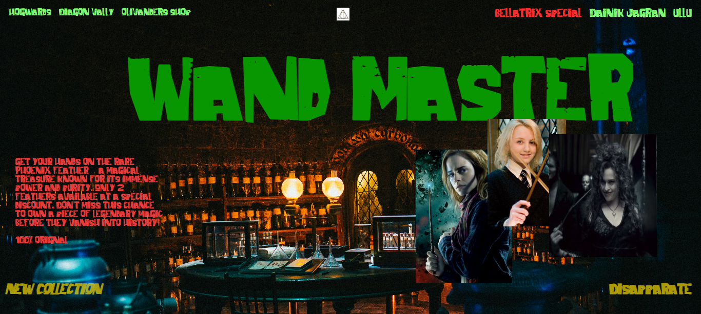

# 🚀 COHORT 2.0 - Practice Tasks and self experiments

This repository contains a collection of **projects, Tasks and Experimental stuff on Tasks ** created as part of my **COHORT 2.0 Fullstack learning journey**.  
Each project is coded **manually without using AI**, following the **old-school approach to build muscle memory and logic* — to understand and grasp every concept clearly 💪

---

## 🎯 Task  - Responsive Hero Section 
### 📸 Preview:
> A visually appealing **Hero section of webpage with responsiveness Mobile-view**

### Live link: https://ishr.netlify.app/

 
### Live link: https://ishr.netlify.app/

> A visually appealing **Hero section of webpage with responsiveness Desktop-view** 

---

## 🎯 Task  - User Finder in number of cards
### 📸 Preview:

> A visually appealing **Email and Password Validation Form with JS**   

---
## 🎯 Task  - Created Download progress-Bar using JS setInterval
### 📸 Preview:

> A visually appealing **Download progress-Bar using JS setInterval and clearTimeout**

---
## 🎯 Task  - Email and Password Validation
### 📸 Preview:

> A visually appealing **Email and Password Validation Form with JS**   

---
## 🎯 Task5  - anime image with Transition and SCSS
### 📸 Preview:

> A visually appealing **Anime Character showcase with SCSS clean code**   

---
## 🎯 Task4  - Bento Grid Layout
### 📸 Preview:

> A visually appealing **Anime Character showcase Grid Layout**   

---

## 🧩 Task 1 - Landing Page
### 📸 Preview:

> A clean  **personal portfolio landing page** showcasing skills, projects Built using **pure HTML, CSS**.

<!-- ---

## 🌐 Task 2 - Agency Landing Page
### 📸 Preview:

> A modern **digital agency homepage** featuring hero sections, services, and client testimonials.  
Fully responsive, designed for **UI consistency and layout precision**. -->

---
## 🎯 Hero Page
### 📸 Preview:

> A visually appealing **Hero section**   
Focused on mastering **CSS animation,Flex, and alignment concepts**.

---
## 🎯 Hero Page
### 📸 Preview:

> A visually appealing **Hero section**   
Focused on mastering **Flex, and alignment concepts**.

---
## 🎯 Hero Page
### 📸 Preview:

> A visually appealing **Hero section**   
Focused on mastering **Grid, and alignment concepts**.

---
## 🎯 Task 3 - Product Landing Page
### 📸 Preview:

> A visually appealing **Apple product showcase landing page**   
Focused on mastering **flexbox, and alignment concepts**.

---

## 💡 About This Repository
- 🧠 Each project was coded from scratch, **without any AI-generated code**.  
- 🎨 Aim: To deeply understand **core principles** — structure, styling, and interactivity.  

> 💬 * The goal is to learn every small detail by practicing the traditional way.*

---

### 🌟 Author
**Mr Shaykh (COHORT 2.0 Student)**  
Fullstack Developer in Progress 🚀

---